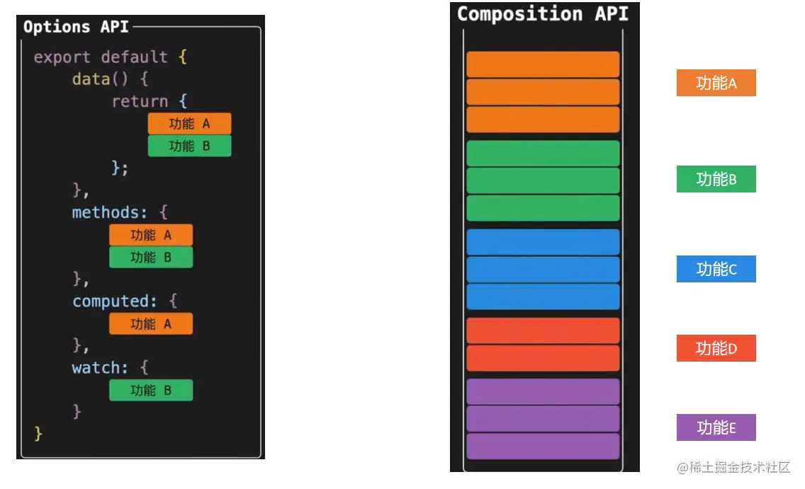

## 1.选项式 API和组合式 API

1. 选项式 API 是基于对象的形式，将所有的方法、数据、计算属性等放置在一个对象中。

2. 组合式 API 通过函数的方式组合逻辑代码，可以更容易地实现组件逻辑的复用以及组合。



## 2.环境搭建

* nvm：node管理器：可以安装多版本的node,方便使用

* 使用vite创建项目`npm create vite@latest`

* Vue 项目脚手架工具创建`npm init vue@latest`或者`vue create <projectName>`

* 运行项目 `npm run dev`

## 3.vue语法

### 1.模版语法

```vue
<template>
  <div>
    {{ a }}
  </div>
</template>
<script setup lang="ts">
const a: string = '123'
</script>
```

### 2.v-text

```vue
<template>
<div>
  {{ a }}
</div>
</template>
<script setup lang="ts">
const a:string = 'hello'
</script>
```

### 3.v-html

```vue
<template>
  <div v-html="a">

  </div>
</template>
<script setup lang="ts">
const a: string = '<p style="color: red">hello world</p>'
</script>
```

### 4.v-if

与v-if相关的还有v-else-if和v-else

```vue
<template>
  <div v-if='isShow == 0'>
    0-{{ a }}
  </div>
  <div v-else-if='isShow == 1'>
    1-{{ a }}
  </div>
  <div v-else>
    else-{{ a }}
  </div>
</template>
<script setup lang="ts">
const a: string = '123';
const isShow: number = 1;
</script>
```

### 5.v-show

v-show和v-if的区别是v-if是真正的条件渲染，v-show只是修改了样式的display的状态

```vue
<div style="display: none;"> 0-123</div>
```

```vue
<template>
  <div v-show='isShow'>
    0-{{ a }}
  </div>
</template>
<script setup lang="ts">
const a: string = '123';
const isShow: boolean = false;
</script>
```

### 6.v-on

事件绑定，简写为`@`

```vue
<template>
  <button @click="clickMethod">button</button>
</template>
<script setup lang="ts">
const clickMethod = () => {
  console.log("点击了按钮");
};
</script>
```

可以使用修饰符

比如说使用`.stop`来阻止冒泡

```vue
<template>
  <button @click="clickParentMethod">
    <button @click.stop="clickMethod">子按钮</button>
  </button>
</template>
<script setup lang="ts">
const clickParentMethod = () => {
  console.log("点击了父元素按钮");
};
const clickMethod = () => {
  console.log("点击了按钮");
};
</script>
```

### 7.v-bind

属性绑定，可简写为`:`

```vue
<template>
  <div :id="a">
    演示v-bind
  </div>
</template>
<script setup lang="ts">
const a:string = '123';
</script>
```


可以动态绑定class，也可以绑定多个class

```vue
<template>
  <div :class="['a', 'b']">
    演示v-bind
  </div>
</template>
<style scoped>
.a {
  color: red;
}

.b {
  font-size: 30px;
  font-weight: bold;
}
</style>
```

### 8.v-model

双向绑定

```vue
<template>
  <input v-model="a" type="text" />
  <p>{{ a }}</p>
</template>
<script setup lang="ts">
import { ref } from "vue";
const a = ref('xiaofei')
</script>
```

### 9.v-for

循环渲染

```vue
<template>
  <div v-for="(item,index) in arr">
  {{index}}--{{ item }}
  </div>
</template>
<script setup lang="ts">
import { ref } from "vue";
const arr:string[] = ['小孔','小狗','小猫'] 
</script>
```


