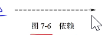
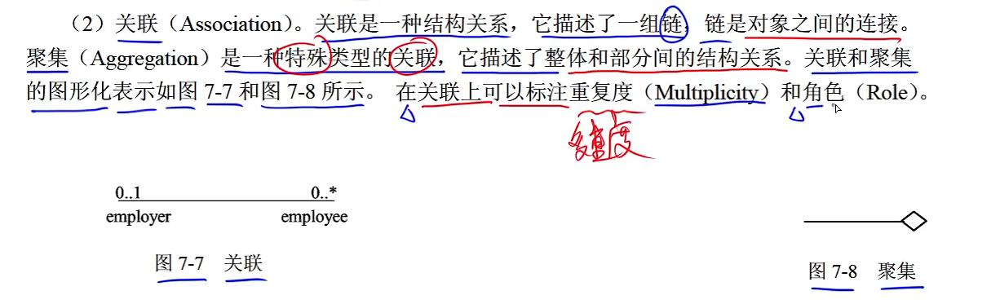
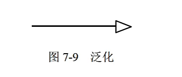
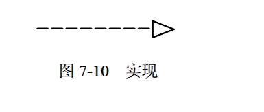
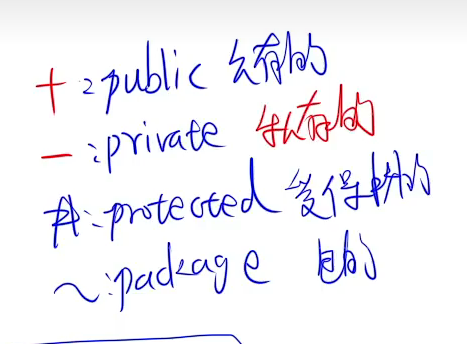

# UML学习
## 关系
UML有四种关系：依赖、关联、泛化和实现
1.依赖关系
  
2.关联关系
  
* 聚集是一种特殊的关联关系，她描述了整体和部分之间的关系    
* 聚合：部分和整体的生命周期不一致，整体消失了，部分还仍然还存在。类似于学生和班级的关系，班级没了，学生还存在。
* 组合：部分和整体的生命周期一致，整体消失了，部分也消失了。类似于公司和部门的关系，公司消失了部分了没了。
3.泛化关系
  
    泛化关系是一种继承关系，用于描述父类和子类之间的关系，它是依赖关系的特例。

4.实现关系
    
    实现关系是接口和实现接口的类之间的关系。

## UML中的图
### 1.类图
类图展现了一组对象、接口、协作和他们之间的关系。
类图通常包括：
1. 类
2. 接口
3. 协作
4. 依赖、泛化和关联关系
 

    +public 公有的
    -private 私有的
    #protected 受保护的
    ~ackage 包的

### 2.用例图
用例图展现了一组用例、参与者（Actor）和它们之间的关系。
通常包括：
用例
参与者
用例之间的扩展关系<<extend>>和包含关系<<include>>。
    
**包含关系**：描述用例和用例之间的关系，一个用例包含另一个用例。