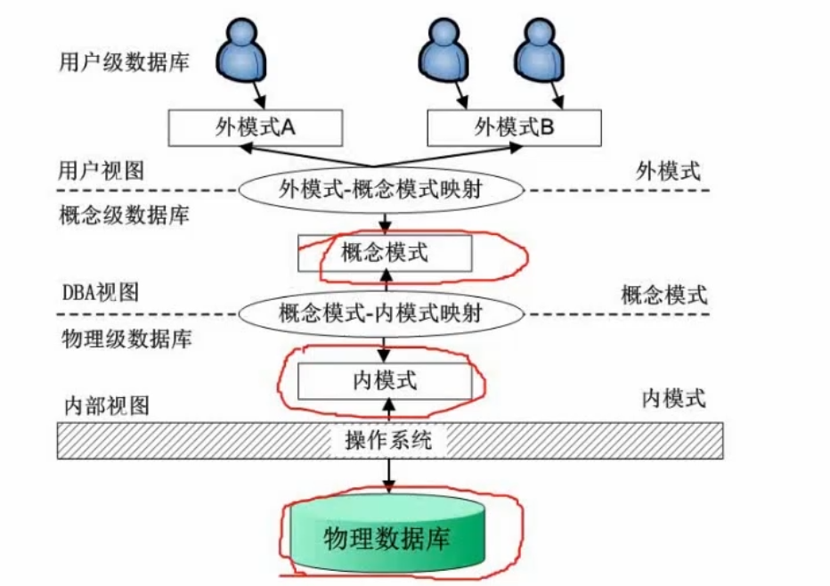
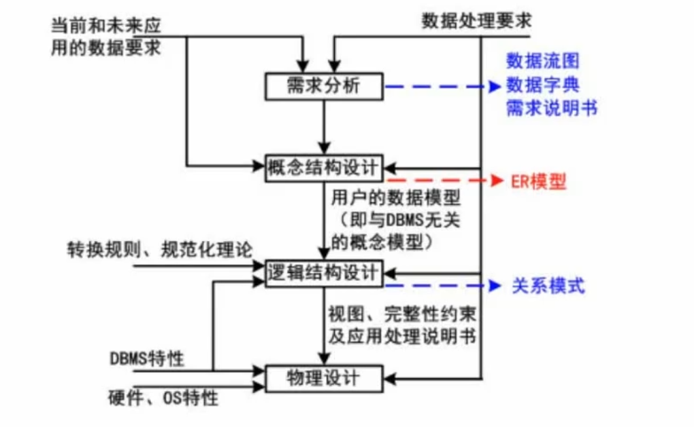
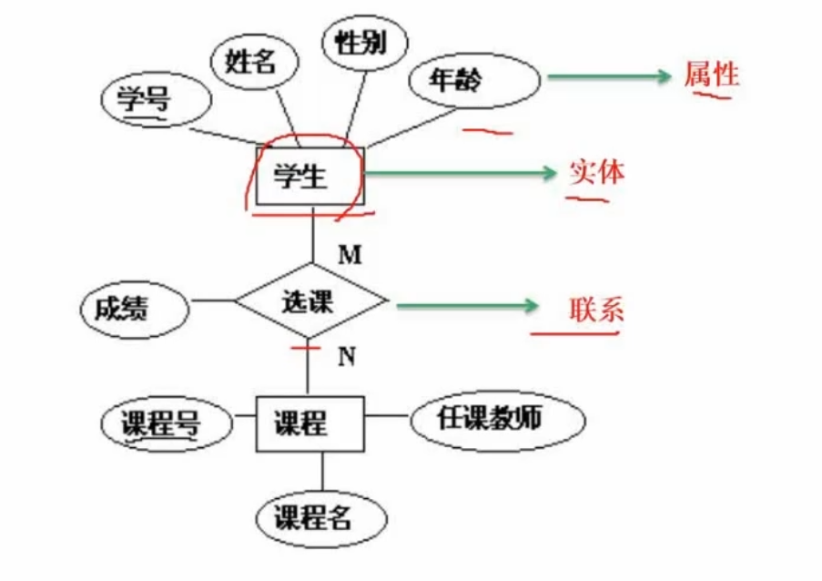
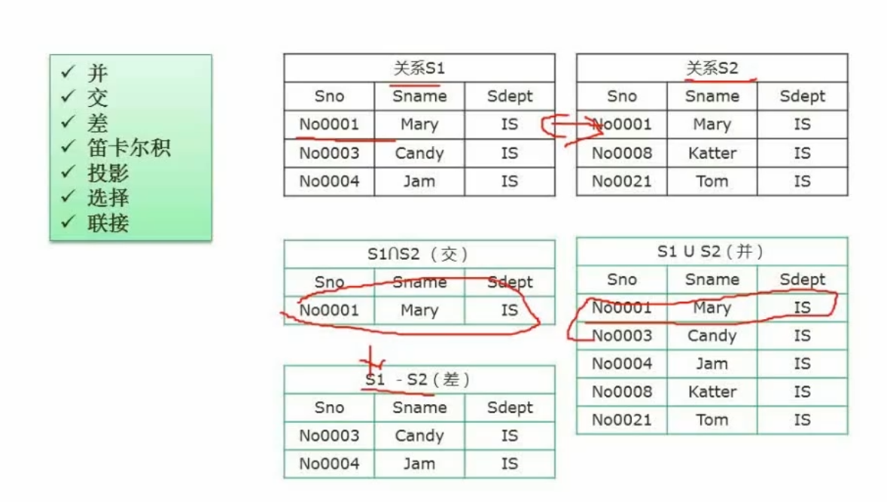
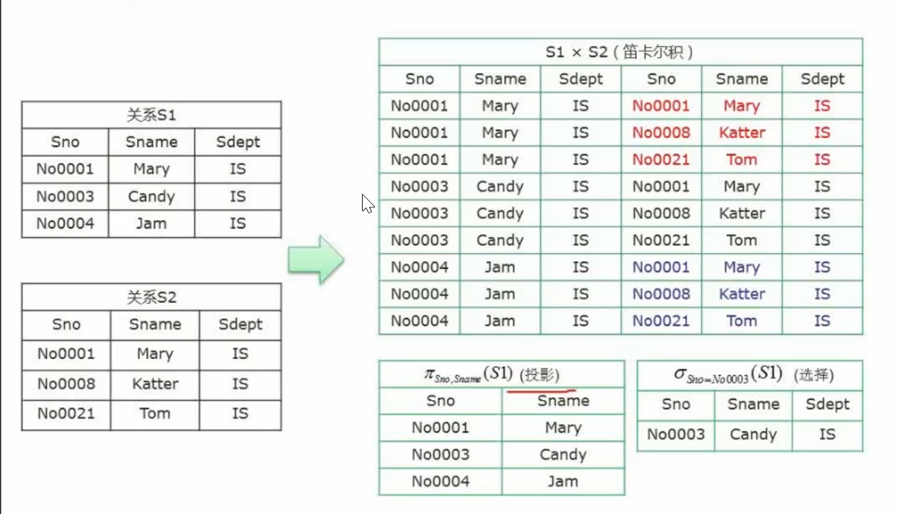
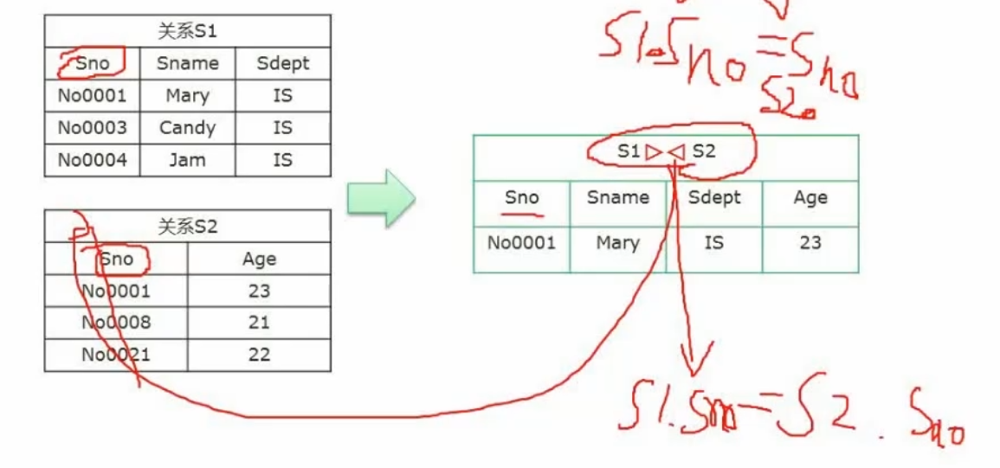
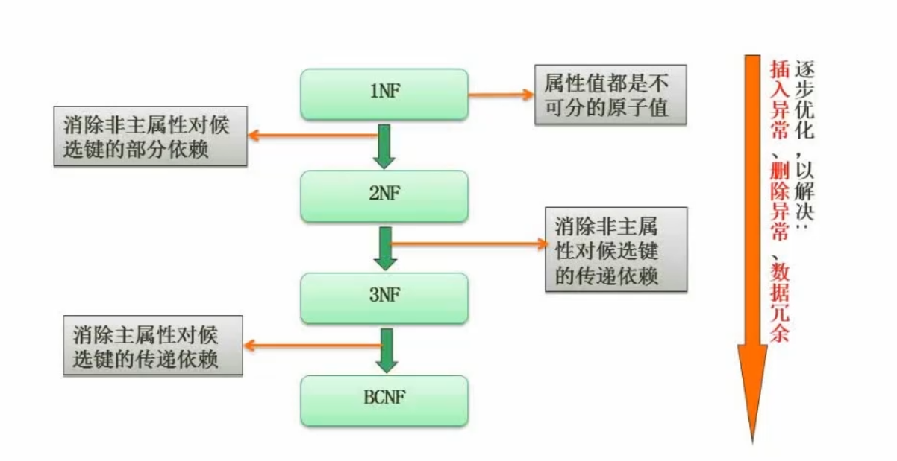

# 数据库系统

## 一、三级模式-两级映射

三级模式是：

1. 外模式
2. 概念模式
3. 内模式

两极映射是：

1. 外模式-概念模式映射
2. 概念模式-内模式映射

## 二、数据库设计过程

## 三、ER模型

属性、实体、联系

## 四、关系代数

七种关系代数表达式
* 交、并、差
  
* 笛卡尔、投影、选择
  
选择选的是行
* 连接操作
  
## 五、规范化理论-函数依赖
设R(U)是属性U上的一个关系模式，X和Y是U的子集，r为R的任一关系，如果对于r中的任意两个元组u，v，只要有u[X]=v[X]，就有u[Y]=v[Y]，则称X函数决定Y，或称Y函数依赖于X，记为X→Y。

### 1.求候选码

### 2.求范式
  
**1NF**
属性值都是不可分的原子值
第一范式(1NF):在关系模式R中，当且仅当所有域只包含原子值，即每个分量都是不可再分的数据项，则称R是第一范式。
**2NF**
属性值都是不可分的原子值，消除非主属性对候选键的部分依赖
第二范式(2NF):当且仅当R是1NF，且每一个非主属性完全依赖主键(不存在部分依赖)时，则称R是第二范式。
**3NF**
属性值都是不可分的原子值，消除非主属性对候选键的传递依赖
第三范式(3NF):当且仅当R是1NF，且E中没有非主属性传递依赖于码时，则称R是第三范式。
**BCNF**
属性值都是不可分的原子值，消除非主属性对候选键的传递依赖，且没有部分依赖
BC范式(BCNF):设R是一个关系模式，F是它的依赖集，R属于BCNF当且仅当其F中每个依赖的决定因素必定包含R的某个候选码。

 

主属性：属于候选关键字的属性称为主属性
非主属性：不属于候选关键字的属性称为非主属性
### 3.模式分解
__保持函数依赖分解__
__无损分解__
有损分解和无损分解
有损分解比如：RAR
无损分解比如：JPG

