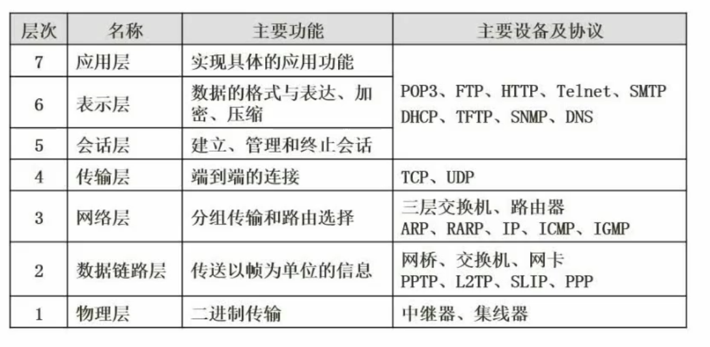
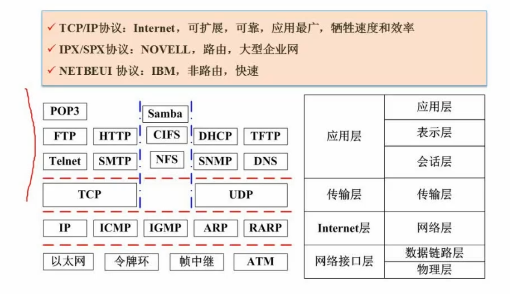

# 计算机网络
## OSI七层模型
- 应用层
- 表示层
- 会话层
- 传输层
- 网络层
- 数据链路层
- 物理层
  

## 网络技术标准与协议
  

## TCP/IP五层模型
__应用层__
    POP3协议：邮件接收协议
    FTP协议：文件传输协议
    HTTP协议：超文本传输协议
    DHCP协议：动态主机配置协议
    SMTP协议：简单邮件传输协议
    TFTP协议：简单文件传输协议
    SNMP协议：简单网络管理协议
    DNS协议：域名系统协议 
__传输层__
    TCP协议：TCP三次握手，具有传输的可靠性。
    UDP协议：不可靠性。
__网络层__
    IP协议：IP地址，IP数据报，IP路由选择。
    ICMP协议：网络控制协议，用于网络故障的诊断和分析。
    ARP协议：地址解析协议，用于将IP地址转换为MAC地址。
    RARP协议：逆地址解析协议，用于在网络故障时，将MAC地址转换为IP地址。
__数据链路层__
    MAC地址：链路层地址，用于在同一个局域网中进行通信。
__物理层__
    网线：物理层传输介质。
    网卡：物理层设备。  
## 计算机网络的分类
按照`分布范围`来分
    1. 局域网（Local Area Network，LAN）
    2. 城域网（Metropolitan Area Network，MAN）
    3. 广域网（Wide Area Network，WAN）
    4. 因特网
按照`拓扑结构`来分
    1. 总线型
    2. 星型
    3. 环型
    
