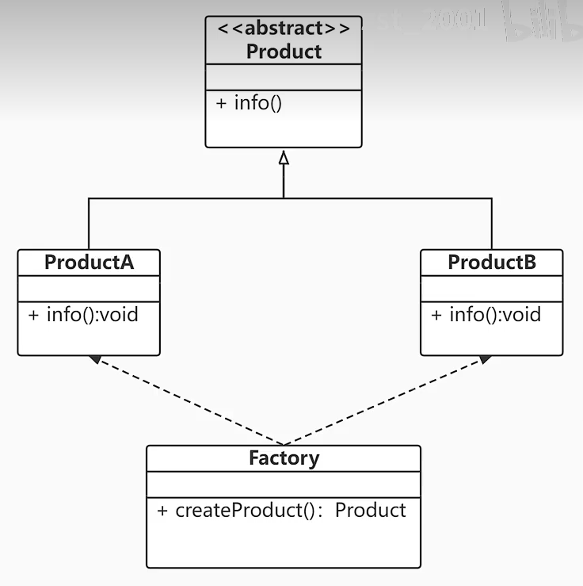

# 设计模式
## 简单工厂模式
定义：定义一个工厂类，根据参数的不同返回不同类的实例，被创建的实例通常具有共同的父类。
  
根据不同的参数，返回不同的实例。
```java
public class SimpleFactory {
    public static void main(String[] args){
        Product productA  = Factory.createProduct("A");
        productA.info();
        Product productB  = Factory.createProduct("B");
        productB.info();
    }
}
abstract class Product{
    public abstract void info();
}
class Factory{
    public static Product createProduct(String type){
        Product product = null;
        switch (type){
            case "A":
                product = new ProductA();
                break;
            case "B":
                product = new ProductB();
                break;
            default:
                System.out.println("没有"+type+"类型的产品！");
                break;
        }
        return product;
    }
}

class ProductA extends Product{
    @Override
            public void info(){
        System.out.println("产品信息：A");
    }

}
class ProductB extends Product{
    @Override
    public void info(){
        System.out.println("产品信息：B");
    }

}
```
三类角色：
工厂：核心
抽象产品：
具体产品：简单工厂模式的创建目标，所有被创建的对象都是某个具体类的实例。
## 工厂方法模式